# 🚀 Infrastructure Live - Production EKS on AWS

> **Best Practices** | **GitOps Ready** | **Cost Optimized** | **Interview Ready**

[](https://www.terraform.io/)
[](https://terragrunt.gruntwork.io/)
[](https://kubernetes.io/)
[](https://aws.amazon.com/eks/)

---

## 📖 Table of Contents

- [Architecture](#️-architecture-overview)
- [Quick Start](#-quick-start)
- [Documentation](#-documentation)
- [Repository Structure](#-repository-structure)
- [Cost](#-cost-breakdown)

---

## 🏗️ Architecture Overview


---

## ⚡ Quick Start

```bash
# 1. Install tools
brew install terragrunt kubectl awscli

# 2. Configure AWS
aws configure

# 3. Deploy everything
./scripts/deploy.sh all

# 4. Verify
kubectl get nodes
kubectl get pods -A

# 5. Cleanup (when done)
ALLOW_DESTROY=true ./scripts/destroy.sh all
```

---

## 📚 Documentation

### 🎨 Interactive Architecture Diagram

**[Open Interactive Diagram](docs/architecture-diagram.html)** ← **Perfect for presentations & interviews!**

A beautiful, interactive HTML visualization featuring:
- 📊 Complete architecture overview with all components
- 🔄 GitOps workflow from code to deployment
- 🌐 Traffic flow and autoscaling diagrams
- ⚙️ Full technology stack
- 📈 Key metrics and achievements

### Documentation Files

Detailed guides are available in the [`docs/`](docs/) directory:

- **[Deployment Guide](docs/DEPLOYMENT.md)** - Complete deployment instructions and configuration
- **[Architecture](docs/ARCHITECTURE.md)** - Detailed architecture and component breakdown
- **[ArgoCD Setup](docs/ARGOCD-SETUP.md)** - GitOps configuration and ApplicationSet management
- **[Pod Identity Migration](docs/POD-IDENTITY.md)** - Modern AWS authentication setup
- **[Troubleshooting](docs/TROUBLESHOOTING.md)** - Common issues and solutions

---

## 🔄 CI/CD Flow


**Flow Details:**
1. Developer pushes to `develop` → CI builds, lints, scans, deploys to **dev**
2. PR from `develop` → `main` → CI validates (lint, test, filesystem scan)
3. Merge to `main` → CI builds, scans, deploys to **staging** (auto)
4. Manual workflow dispatch → deploys to **production** (manual ArgoCD sync)

---

## 🌐 Traffic Flow

```mermaid
graph TD
    A[🌍 Internet<br/>User Request] --> B[🔀 Route53<br/>DNS Resolution]
    B --> C[⚖️ ALB<br/>TLS Termination]
    C --> D[🔧 Ingress-NGINX<br/>Path/Host Routing]
    D --> E[📦 App Service<br/>ClusterIP]
    E --> F[🐳 App Pods<br/>Karpenter Nodes]
    F --> G[✅ Response]

    H[🔐 Secrets Manager] -.->|External Secrets| F
    I[📦 ECR] -.->|Pull Image| F

    style A fill:#e1f5fe
    style C fill:#fff3e0
    style D fill:#f3e5f5
    style F fill:#c8e6c9
    style G fill:#c5e1a5
```



---

## 📂 Repository Structure

```
infra-live/
├── 📄 README.md                     You are here
├── 🚀 deploy.sh                     Automated deployment
├── 🧹 destroy.sh                    Cleanup script
├── ⚙️  terragrunt.hcl                Root configuration
│
├── 🔧 bootstrap/                    Phase 1: S3 + DynamoDB
│   └── terragrunt.hcl
│
├── 📦 modules/                      Terraform modules
│   ├── vpc/                        Network
│   ├── eks/                        Cluster
│   ├── karpenter/                  Autoscaling
│   ├── aws-load-balancer-controller/  ALB
│   ├── ingress/                    Routing (ALB + NGINX)
│   ├── external-secrets/           Secrets
│   ├── argocd/                     GitOps
│   └── ecr/                        Registry
│
├── 🔬 dev/                          Dev environment
│   ├── env.hcl                     Config
│   ├── vpc/
│   ├── eks/
│   ├── karpenter/
│   ├── aws-load-balancer-controller/
│   ├── ingress/
│   ├── external-secrets/
│   └── argocd/
│
├── 🏭 prod/                         Prod environment
│   └── ... (same as dev)
│
└── 📦 ecr/                          Shared registry
    └── terragrunt.hcl
```

---

## 🚀 Deployment

### Method 1: Automated (Recommended)
```bash
./scripts/deploy.sh all  # Deploy all
./scripts/deploy.sh dev  # Dev only
./scripts/deploy.sh prod # Prod only
```

### Method 2: Manual
```bash
# Bootstrap
cd bootstrap && terragrunt apply

# Dev
cd dev && terragrunt run-all apply

# Prod
cd prod && terragrunt run-all apply

# ECR
cd ecr && terragrunt apply
```

### Post-Deployment
```bash
# Connect
aws eks update-kubeconfig --name myapp-dev --region us-east-1

# Verify
kubectl get nodes
kubectl get pods -A

# Get ArgoCD password
kubectl -n argocd get secret argocd-initial-admin-secret \
  -o jsonpath="{.data.password}" | base64 -d

# Access ArgoCD
kubectl port-forward svc/argocd-server -n argocd 8080:443
# → https://localhost:8080
```

### ArgoCD ApplicationSets

After infrastructure deployment, ApplicationSets are automatically applied by `deploy.sh`.

**What ApplicationSets do:**
- **Dev cluster**: Creates 2 applications (myapp-dev, myapp-staging) with auto-sync
- **Prod cluster**: Creates 1 application (myapp-production) with manual sync

**Verify deployment:**
```bash
# Check ApplicationSets
kubectl get applicationset -n argocd

# Check generated Applications
kubectl get application -n argocd

# View in ArgoCD UI
kubectl port-forward svc/argocd-server -n argocd 8080:443
# → https://localhost:8080
```

**Note:** ApplicationSets are managed by the ArgoCD Terraform module in `modules/argocd/`. No manual `kubectl apply` is needed — they are deployed automatically with `terragrunt apply`.

---

## 🔧 Troubleshooting

### ArgoCD Applications Not Syncing

**Symptom:** Applications show "Unknown" or "OutOfSync" status

**Solution:**
```bash
# 1. Check GitHub PAT secret
kubectl get secret -n argocd github-token

# If missing, create it:
kubectl -n argocd create secret generic github-token \
  --from-literal=token=YOUR_GITHUB_PAT

# 2. Check ArgoCD logs
kubectl logs -n argocd deployment/argocd-repo-server
kubectl logs -n argocd deployment/argocd-application-controller

# 3. Manually sync
kubectl patch application myapp-dev -n argocd --type merge \
  -p '{"operation": {"sync": {}}}'
```

### Karpenter Not Scaling

**Solution:**
```bash
# Check logs
kubectl logs -n karpenter deployment/karpenter

# Verify NodePool exists
kubectl get nodepool
kubectl get ec2nodeclass

# Check pending pods
kubectl get pods -A | grep Pending
```

### Ingress Not Creating ALB

**Solution:**
```bash
# Check AWS Load Balancer Controller logs
kubectl logs -n kube-system deployment/aws-load-balancer-controller

# Verify ingress created
kubectl get ingress -n argocd

# Check service annotations
kubectl get svc -n ingress-nginx ingress-nginx-controller -o yaml
```

### EKS Nodes Not Joining

**Solution:**
```bash
# Check node status
kubectl get nodes

# Check node logs
aws ec2 describe-instances --filters "Name=tag:eks:cluster-name,Values=myapp-dev" \
  --query 'Reservations[].Instances[].[InstanceId,State.Name]'

# Verify IAM role permissions
aws eks describe-nodegroup --cluster-name myapp-dev --nodegroup-name system
```

### Terraform State Lock Issues

**Solution:**
```bash
# Check current locks
aws dynamodb scan --table-name terraform-locks-471448382412

# Force unlock (use with caution!)
terragrunt force-unlock LOCK_ID
```

---

## 🔗 CI/CD Integration

### GitHub Actions Workflow

**Triggers:**
- Push to `develop` → build + deploy to dev
- Push to `main` (PR merge) → build + deploy to staging
- PRs to `main`/`develop` → lint + test + filesystem scan (no deploy)

**Pipeline steps:**
1. Lint (ESLint) → Test → Build Docker image
2. Trivy scan (blocks on HIGH/CRITICAL CVEs)
3. Push to ECR with short SHA tag
4. Update `helm-charts` repo overlay → ArgoCD auto-syncs

**ArgoCD sync policy:**
- **Dev**: Auto-sync on develop push
- **Staging**: Auto-sync on main merge
- **Prod**: Manual sync in ArgoCD UI (requires approval)

**Setup:**
1. GitHub Secrets: `AWS_ACCOUNT_ID`, `GH_PAT`
2. OIDC role: `GitHubActionsECRAccess` (Terraform-managed in ECR module, scoped permissions)

**Manual Promotion (Production only):**
```bash
# Use the GitHub Actions workflow_dispatch:
# Actions → "Promote to Production" → enter image tag
# Then manually sync in ArgoCD UI
```

---

## 💰 Cost Breakdown

| Environment | Control Plane | NAT | Nodes | **Total** |
|-------------|--------------|-----|-------|-----------|
| **Dev** | $73 | $32 | $60+ | **~$165/mo** |
| **Prod** | $73 | $32 | $60+ | **~$165/mo** |

### Cost Optimizations
- ✅ **Spot instances** in both environments (~70% savings)
- ✅ **Karpenter consolidation** (auto-removes underutilized nodes)
- ✅ **Single NAT Gateway** per VPC (cost saving)
- ✅ **Karpenter CPU limit** capped at 20 vCPU (prevents runaway costs)
- ✅ **ECR lifecycle policies** (auto-delete old images)

---

## 🔍 Module Dependency Graph


---

## 🎯 Interview Talking Points

### Q: Why separate EKS clusters for dev and prod?

> **Blast radius containment** - Bad configs in dev can't affect prod. Also enables **independent scaling**: dev uses smaller instance families (t3/t3a/t2), while prod uses production-grade (m5/m6i/c5). Both use spot + on-demand with single NAT for cost optimization.

### Q: Why Karpenter instead of Cluster Autoscaler?

> **3 key advantages:**
> 1. **Faster** - 30-60s vs 3-5min node provisioning
> 2. **Smarter** - Picks cheapest instance that fits workload
> 3. **Cost-effective** - Auto-consolidates underutilized nodes

### Q: Explain the traffic flow from internet to app.

> **Internet → Route53 (DNS) → ALB (TLS termination) → Ingress-NGINX (routing) → Service → Pods**
>
> ALB handles AWS-specific features (security groups, target groups), while NGINX provides flexible routing (path/host rules).

### Q: How are secrets managed?

> **External Secrets Operator** syncs from **AWS Secrets Manager**. Secrets never touch Git. Path-based isolation (`dev/*` and `prod/*`) with IAM policies ensures dev can only read dev secrets.

### Q: What is IRSA and why use it?

> **IAM Roles for Service Accounts** - Uses OIDC to map K8s ServiceAccounts to specific IAM roles. Each pod gets exactly the permissions it needs, unlike EC2 instance roles which grant the same permissions to all pods on a node.

---

## 🔐 Security Features

| Feature | Implementation |
|---------|---------------|
| **IRSA** | Karpenter, AWS LBC, External Secrets use IRSA |
| **Secrets** | AWS Secrets Manager + External Secrets Operator |
| **Network** | Private subnets for nodes, public for ALB only |
| **Container** | Non-root, read-only filesystem, dropped capabilities |
| **Scanning** | Trivy in CI (blocks build) + ECR scan on push |
| **State** | S3 with encryption + DynamoDB locking |

---

## ✨ Best Practices Checklist

- [x] **DRY Configuration** - Terragrunt eliminates duplication
- [x] **State Management** - S3 backend with DynamoDB locking
- [x] **Cost Optimization** - Karpenter spot instances & consolidation
- [x] **High Availability** - Multi-AZ, PDBs, topology spread
- [x] **GitOps** - ArgoCD for declarative deployments
- [x] **Monitoring Ready** - Metrics server for HPA
- [x] **Secrets Management** - External Secrets Operator
- [x] **Immutable Infrastructure** - Everything in code

---

## 📚 Related Repositories

1. **[infra-live](.)** (this repo) - Terraform/Terragrunt infrastructure
2. **[helm-charts](../helm-charts)** - Generic Helm chart + app configs
3. **[app-source](../app-source)** - Application code + CI/CD

---

## 🧹 Cleanup

```bash
# Destroy specific environment
ALLOW_DESTROY=true ./scripts/destroy.sh dev

# Destroy everything (dev + prod + ECR + bootstrap)
ALLOW_DESTROY=true ./scripts/destroy.sh all
```

---

## 🔧 Maintenance Tasks

### Update Kubernetes Version
```bash
# Edit env.hcl
eks_version = "1.31"

# Apply
cd dev/eks && terragrunt apply
```

### Scale Karpenter Limits
```bash
# Edit env.hcl, then:
cd dev/karpenter && terragrunt apply
```

### Node Rotation
Karpenter auto-rotates nodes every 30 days (`expireAfter: 720h`)

---

<div align="center">

**🚀 Built for Production | 💼 Interview Ready | ❤️ Open Source Inspired**

[⬆ Back to Top](#-infrastructure-live---production-eks-on-aws)

</div>
